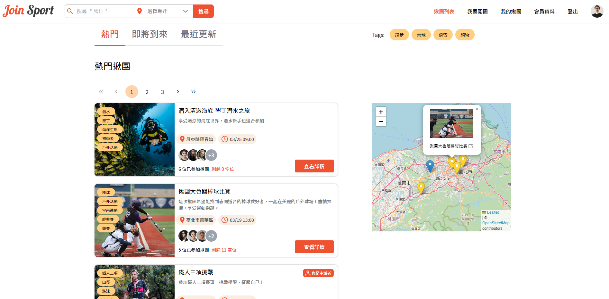
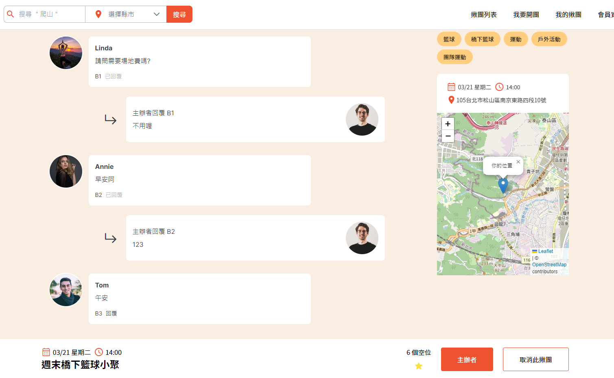

# JoinSport 運動揪團平台

以 Vue 製作的單頁式應用網站 (SPA)，可觀看桌面板 (體驗佳) 及手機版 (RWD)  

### Demo：[https://key0329.github.io/JoinSport/#/](https://key0329.github.io/JoinSport/#/)
註: 模擬資料庫部屬於 Render，如觀看時暫停於 Loading 畫面請稍後約 30 秒等待喚醒，便可正常操作。

相關連結：[Site Map 網站地圖](https://whimsical.com/site-map-join-sport-PAW5csqMBe9ZWiqns38Wxx)、[Wireframe 線稿圖](https://www.figma.com/file/Hs6V5EqxHEHnbaFMQPy6v1/Join-Sport?node-id=0%3A1&t=mXbVVTZDYyZPeE3X-0)

</br>




## 本地端下載觀看 

環境：Vue / Vite 4.0.0
需搭配 Json-Server (下方連結)

### 取得專案
```
git clone https://github.com/Key0329/JoinSport.git
```

### 移動至專案
```
cd JoinSport
```

### 安裝套件
```
npm install
```

### 運行專案
```
npm run dev
```
### 開啟專案
在瀏覽器網址列輸入以下即可看到畫面
```
http://localhost:5173/JoinSport/
```


</br>


## 下載 Json-Server 資料庫
此專案使用 Json-Server 模擬 API，在本地端觀看請需搭配下載 Json-Server 資料庫並且獨立運行 ( GitHub Page 已連線遠端資料庫故無需另外下載，建議可直接使用上方 Demo 連結直接觀看 )

Repo：https://github.com/Key0329/JoinSport-server-Render

### 取得專案
```
git clone https://github.com/Key0329/JoinSport-server-Render.git
```

### 移動至專案
```
cd JoinSport-server-Render
```

### 安裝套件
```
npm install
```

### 運行專案
```
json-server-auth --watch db.json
```

</br>

## 帳號密碼

```
帳號：jack@mail.com
密碼：123456Aa
```

為體驗順暢，登入帳號密碼及開團表單部分已先代入相關資訊，可直接使用</br>
體驗者也可嘗試註冊功能後登入以及嘗試自行填寫開團表單

</br>

## 網站功能
### 參與者
- 瀏覽所有揪團
- 關鍵字搜尋、標籤搜尋、地區篩選、熱門排序
- 地圖觀看活動位置
- 觀看詳細活動資訊，參加別人開的揪團
- 活動留言板
- 收藏有興趣的揪團
- 管理已參加及收藏的揪團
- 管理個人資訊
 
### 開團者
- 根據網站提供步驟快速開團
- 開團者管理自己主持的團、編輯開團資訊

</br>

## 專案技術
- Vite 環境建置
- Vue 3 Options API
- Vue Router 建構路由
- Pinia 全局狀態管理
- 元件拆分與使用
- Vue axios 串接 RESTful API 資料
- Tailwind 完成 RWD 版型
- ESLint (airbnb) + Prettier 統一程式碼結構
- PrimeVue UI 框架
- Leaflet、OpenStreetMap 串接地圖、Google Geocoding API
- Json-Server-Auth 設計簡易資料庫並模擬 API 進行串接
- Vuelidate 表單驗證、Vue-i18n

</br>


## 設計稿提供

感謝六角學院合作設計師 
#### [Claire LIN](https://www.figma.com/file/eL7NwmFJE0f6DhYnR6rPKD/Join-Sport-%E6%8F%AA%E9%81%8B%E5%8B%95?node-id=7%3A550&t=Rb3uMpzlsKzFX3I0-0)
設計的首頁

</br>

## Contact me 聯繫我
- Email：springfield0329@gmail.com
- Discord：JackC#0411

